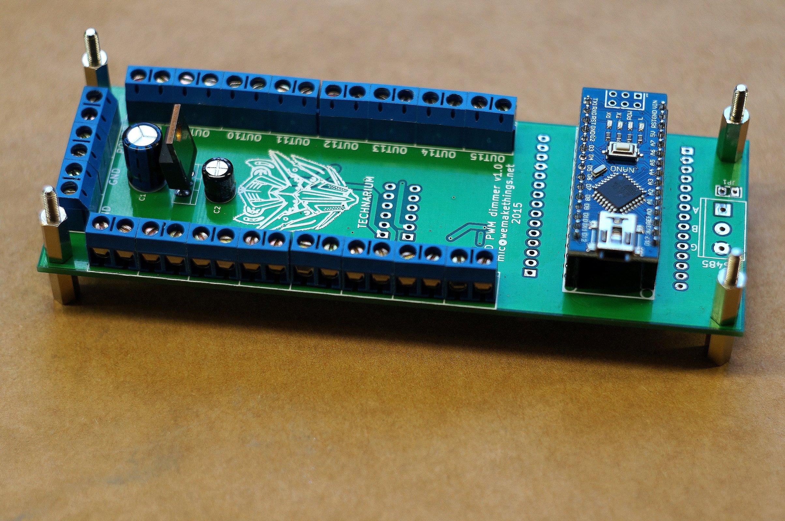

# TLC5940-LED-dimmer
16 channel 12bit PWM dimmer with RS485 interface based on Arduino and TLC5940. Also available on [Tindie](https://www.tindie.com/products/miceuz/16-channel-12-bit-pwm-led-dimmer/)

